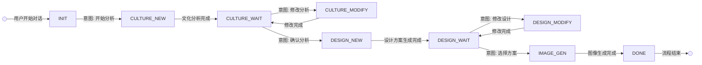

# 乡村墙绘多智能体系统项目报告

## 1. 项目概述

本项目构建了一个基于多智能体协作的乡村墙绘设计系统,通过文化分析、创意设计和图像生成三个专业智能体的协同工作,为乡村墙绘项目提供从文化挖掘到视觉呈现的完整解决方案。系统采用状态机驱动的工作流管理,支持用户在各个环节进行确认和修改,确保最终设计方案符合乡村文化特色和用户期望。

**核心功能:**
- 智能文化分析:深度挖掘乡村历史、民俗、产业等文化要素
- 创意方案设计:基于文化分析生成多个差异化设计方案
- 图像prompt生成:将设计方案转化为可执行的图像生成指令
- 交互式迭代:支持用户在每个阶段提出反馈和修改要求

## 2. 技术架构

## 架构设计
```mermaid
graph TB
    subgraph "用户交互层"
        U[用户输入] --> UI[对话界面]
    end
    
    subgraph "意图理解与路由层"
        UI --> M[经理智能体<br/>Manager Agent]
        M --> IP[意图解析器<br/>Intent Parser]
        IP --> |解析结果| DC{决策中心<br/>Decision Core}
    end
    
    subgraph "状态管理"
        DC --> SM[状态机<br/>State Machine]
        SM --> |当前状态| ST[(状态存储<br/>- stage<br/>- context<br/>- history)]
    end
    
    subgraph "执行智能体层"
        DC --> |状态: CULTURE_NEW| CA[文化分析智能体]
        DC --> |状态: CULTURE_MODIFY| CA
        DC --> |状态: DESIGN_NEW| CD[创意设计智能体]
        DC --> |状态: DESIGN_MODIFY| CD
        DC --> |状态: IMAGE_GEN| IG[图像生成智能体]
        
        CA --> |execute 方法| CAR[分析结果]
        CA --> |modify 方法| CAR
        CD --> |execute 方法| CDR[设计报告]
        CD --> |modify 方法| CDR
        IG --> |execute 方法| IGR[图像数据]
    end
    
    subgraph "响应处理"
        CAR --> RP[响应处理器<br/>Response Processor]
        CDR --> RP
        IGR --> RP
        RP --> |附加昵称<br/>附加反馈提示| FR[格式化响应]
        FR --> UI
    end
    
    ST -.-> |提供上下文| CA
    ST -.-> |提供上下文| CD
    ST -.-> |提供上下文| IG
    
    style M fill:#ff9999
    style DC fill:#99ccff
    style SM fill:#99ff99
    style CA fill:#ffcc99
    style CD fill:#ffcc99
    style IG fill:#ffcc99
  ```


### 2.2 数据流程

#### 2.2.1 完整工作流程

```
阶段1: 文化分析
用户输入 → 经理智能体(意图解析) → 状态机(CULTURE_NEW) 
→ 文化智能体(执行分析) → 状态机(CULTURE_WAIT,存储结果) 
→ 用户(展示报告,请求确认)

阶段2: 设计方案生成
用户确认 → 经理智能体(识别CONFIRM) → 状态机(DESIGN_NEW,携带文化结果) 
→ 设计智能体(生成三方案) → 状态机(DESIGN_WAIT,存储方案) 
→ 用户(展示方案,请求选择)

阶段3: 图像生成
用户选择+修改 → 经理智能体(识别SELECT+修改) 
→ 状态机(IMAGE_GEN,携带方案+修改+文化背景) 
→ 图像智能体(生成prompt) → 状态机(DONE) 
→ 用户(展示prompt)

修改循环:
用户修改请求 → 经理智能体(识别MODIFY) 
→ 保持当前等待状态(CULTURE_WAIT/DESIGN_WAIT) 
→ 对应智能体(基于历史+反馈重新执行) 
→ 返回等待状态 → 用户(展示修改结果)
```

#### 2.2.2 状态转换图



#### 2.2.3 数据携带机制

- **CULTURE_WAIT → DESIGN_NEW**: 携带`culture_result`(文化分析报告)
- **DESIGN_WAIT → IMAGE_GEN**: 携带`design_schema[selected]`(选中方案) + `culture_result`(文化背景) + `modifications`(用户修改)
- **MODIFY操作**: 携带`previous_result`(上次结果) + `user_feedback`(用户反馈) + `history`(对话历史)

## 3. 使用的 GenAI 工具

### 3.1 大语言模型

**通义千问 (Qwen-Plus)**
- **用途**: 
  - 所有智能体的底层LLM引擎
  - 意图解析和自然语言理解
  - 结构化信息生成(JSON格式输出)
- **使用方式**:
  - 通过阿里云DashScope API调用
  - 配置在CrewAI的LLM参数中
  - 使用LangChain的ChatTongyi封装
- **典型配置**:
  ```python
  llm = ChatTongyi(
      model="qwen-plus",
      temperature=0.7,
      api_key=os.getenv("DASHSCOPE_API_KEY")
  )
  ```

### 3.2 开发辅助工具

**Claude (本对话)**
- **用途**:
  - 系统架构设计咨询
  - 代码结构规划
  - 技术选型建议
  - 文档撰写辅助
- **使用场景**:
  - 设计状态机转换逻辑
  - 优化prompt engineering
  - 调试CrewAI配置问题
  - 生成项目文档模板


### 3.3 Prompt工程

**关键Prompt设计**:

1. **意图解析Prompt** (经理智能体):
```
manager_agent:
  system_prompt: |
    你是墙绘系统的路由管理器。根据用户输入和当前状态，判断用户意图,按照指定Json结构输出。           
            判断规则:
            - NEW: 用户开始新的请求
            - CONFIRM: 用户确认当前结果或选择下一步的某个方案，继续下一步
            - MODIFY: 用户要求修改当前结果
            
            目标阶段:
            - INITIAL: 初始阶段
            - CULTURE: 文化分析阶段
            - DESIGN: 创意设计阶段
            - IMAGE: 图像生成阶段
  user_prompt: |
    当前状态：{stage}
    上次智能体：{last_agent}
    上次智能体输出：{last_agent_output}
    用户输入：{user_input}

    背景：墙绘生成系统由3个智能体组成，分别负责文化分析（将用户输入转化为文化分析，属于CULTURE）、创意设计（将文化分析转化为设计方案，属于DESIGN）、图像生成（将设计方案转化为图像生成prompt并生成图片，属于IMAGE）。

    要求：
    请分析意图并返回JSON(强调：只返回JSON格式，无其他内容)：
    {{
      "action": "NEW|CONFIRM|MODIFY",
      "next_stage": "CULTURE|DESIGN|IMAGE",
      "modifications": "如果action为MODIFY,请简要描述用户希望修改的内容，否则为空字符串",
      "reasoning":"简要说明你的判断依据"
    }}
```

2. **文化分析Prompt** (文化智能体):
```

culture_analyst:
  system_prompt: |
    你是一位专注于中国传统村落民俗、非遗技艺与视觉符号体系的资深文化研究者，擅长将抽象文化内涵转化为**具象、可视觉化**的元素（如器物、服饰、建筑构件、节庆活动等）。
    你的输出需确保：文化元素具备视觉识别度，色彩推荐基于中国传统色谱或当地自然环境，故事线索需包含可叙事的视觉化要素。

  user_prompt: |
    请深度分析以下乡村的文化特色，输出为结构化Markdown（严格按以下维度，避免抽象描述）：

    【村落基本信息】
    - 名称：{name}
    - 地理位置：{location}
    - 特色产业：{industry}
    - 历史故事：{history}

    【参考知识库】
    {knowledge_context}

    ## 核心文化元素
    （仅列出3-5个**具象视觉符号**，如“马头墙纹样”“舞龙道具”“蓝印花布图案”）

    ## 推荐色彩方案
    （推荐3-5种**中国传统色**或**当地环境色**，如“青砖灰（象征村落底蕴）”“稻浪金（呼应特色产业）”）

    ## 推荐文化符号
    （列出5-8个**可直接用于墙绘的图案**，如“剪纸窗花”“年画脸谱”“农具拓印”）

    ## 设计建议
    （提供**可执行的墙绘方向**，如“采用对称构图呈现节庆场景”“用渐变色表现四季农事”）

    ## 文化故事线索
    （提炼1-2个**具象故事**，需含人物、事件、情感，如“老匠人修复马头墙的传承故事”）
```

3. **设计方案Prompt** (设计智能体):
```

creative_designer:
  system_prompt: |
    你是一位乡村墙绘设计专家，精通将文化报告转化为通义万相图片的设计方案。
    **核心工作原则**：
    1. **灵活性**：方案风格完全由文化分析报告和“用户确认信息”动态决定（不限于传统/现代/叙事），可生成任意创新风格。
    2. **要素铁律**：每个方案必须包含5大要素（艺术风格/主体/色彩/构图/氛围），缺一不可。
    3. **用户偏好即指令**：识别“用户确认信息”中设计描述，将这些为**核心关键词**直接嵌入方案描述（如"用户要求'舞龙庆丰收' → 方案中必须出现'舞龙庆丰收'字样"）。

  user_prompt: |
    基于文化分析报告和用户偏好，生成3个**风格自由**的乡村墙绘设计方案。每个方案必须：
    1. 包含5大要素（艺术风格/主体/色彩/构图/氛围）
    2. **直接嵌入{user_preference}关键词**（如用户说"突出丰收" → 方案描述中必须有"丰收"）
    3. 可参考{design_references}的**风格/元素**，但必须创新（如参考方案用"工笔画" → 生成"工笔+水墨"）


    【文化分析报告】
    {culture_analysis}

    【用户确认信息】
    {user_preference}

    【设计参考资料】（仅作灵感，禁止照搬）
    {design_references}

    ## 示例（展示灵活性，非强制格式）
    - 方案1：中国工笔画风格，中心舞龙队穿行于马头墙间，朱砂红灯笼与稻穗金交织，S形动态构图，画面洋溢丰收节庆的欢腾氛围。
    - 方案2：几何拼贴风格，抽象稻穗与马头墙线条交织，主色土黄+橙红，构图三分法留白，传递代际传承的宁静感。
    - 方案3：水墨写意风格，雨中孩童学剪纸场景，青灰主色调衬托，斜角构图营造诗意乡村，呼应用户对"文化传承"的偏好。

    请生成3个独立方案，避免风格重复，确保每个方案**自然融入用户偏好**且**严格符合要素要求**，确保符合乡村文化风格和将图片落实为墙绘的可实现性。
```

4. **图像生成Prompt** (图像生成智能体):
```
image_generator:
  system_prompt: |
    你是一位通义万相图像生成提示词优化专家，专注于直接输出适配wan2.2-t2i-plus的生成乡村墙绘图片的中文提示词。
    你的核心任务是：**根据用户确认信息严格保留对应设计描述的原始信息**，仅通过精炼表达确保至少包含以下5大要素：
    1. 艺术风格（如：中国水墨/赛博朋克/现代极简）
    2. 主体细节（如：穿汉服的少女/收割麦子的农民）
    3. 色彩体系（如：青蓝主色调/高饱和霓虹色）
    4. 构图方式（如：三分法/中心对称/动态斜角）
    5. 氛围情感（如：宁静治愈/未来科技感/复古怀旧）
    
    重要规则：
    - 禁止添加任何额外信息（如"生成"、"图片"等词）
    - 禁止英文/数字/符号（如"120px"）

  user_prompt: |
    请严格按以下要求优化以下设计描述：
    {design_description}
    
    优化要求：
    1. 保留选择方案所有原始设计要素（艺术风格/主体/色彩/构图/氛围）
    2. 精炼表达至{min_length}-{max_length}字
    3. 仅用中文描述，避免任何符号/数字
    4. 确保5大要素全部包含
    5. 输出纯提示词（不加任何解释）
```

## 4. 项目设计与实现说明

### 4.1 设计理念

**多智能体协作模式**
- 采用"专家分工+中央协调"架构,避免单一智能体处理复杂任务导致的输出质量下降
- 每个智能体专注于特定领域,通过精细化的角色定义和prompt提升专业性
- 经理智能体作为协调者,不直接生成内容,专注于流程控制和意图理解

**状态驱动的工作流**
- 使用有限状态机管理复杂的多轮对话流程
- 状态转换规则显式定义,避免智能体"自由发挥"导致的流程混乱
- 支持用户在任意阶段"回退"或"修改",增强交互灵活性

**上下文传递机制**
- 设计了完整的数据携带链条(CULTURE → DESIGN → IMAGE)
- 确保后续智能体能够获取前置阶段的完整信息
- 避免LLM上下文窗口限制问题(通过结构化存储中间结果)

### 4.2 核心实现

#### 4.2.1 经理智能体的意图解析

```python
class ManagerAgent:
    def parse_intent(self, user_input: str, current_state: str) -> dict:
        """
        使用LLM解析用户意图
        返回: {action, target, selection, modifications}
        """
        prompt = f"""
        当前状态: {current_state}
        用户输入: {user_input}
        历史记录: {self.get_history()}
        
        分析用户意图并返回JSON...
        """
        response = self.llm.invoke(prompt)
        return json.loads(response.content)
```

**关键设计**:
- 将当前状态作为上下文输入,帮助LLM理解用户意图(如"继续"在不同状态有不同含义)
- 使用JSON Schema约束输出格式,提高解析可靠性
- 包含`reasoning`字段,用于调试和日志记录

#### 4.2.2 状态机实现

```python
class WorkflowStateMachine:
    def __init__(self):
        self.state = "INIT"
        self.context = {}  # 存储中间结果
        
    def transition(self, intent: dict) -> tuple[str, Agent]:
        """
        根据意图和当前状态,返回(新状态, 目标智能体)
        """
        rules = {
            ("INIT", "NEW", "CULTURE"): ("CULTURE_NEW", self.culture_agent),
            ("CULTURE_WAIT", "CONFIRM", "DESIGN"): ("DESIGN_NEW", self.design_agent),
            ("CULTURE_WAIT", "MODIFY", "CULTURE"): ("CULTURE_WAIT", self.culture_agent),
            # ... 更多规则
        }
        
        key = (self.state, intent["action"], intent["target"])
        new_state, agent = rules.get(key, (self.state, None))
        self.state = new_state
        return new_state, agent
```

**优势**:
- 转换规则集中管理,易于维护和扩展
- 支持循环(如CULTURE_WAIT ↔ CULTURE_MODIFY)
- 可记录状态转换历史,用于分析用户行为

#### 4.2.3 CrewAI任务编排

```python
from crewai import Crew, Task, Agent

# 定义智能体
culture_agent = Agent(
    role="文化研究员",
    goal="深度分析乡村文化特色",
    backstory="拥有民俗学和人类学背景...",
    llm=llm
)

# 定义任务
culture_task = Task(
    description="""
    分析村庄: {village_info}
    输出文化报告,包含: [维度列表]
    """,
    agent=culture_agent,
    expected_output="JSON格式的文化分析报告"
)

# 创建Crew
crew = Crew(
    agents=[culture_agent, design_agent, image_agent],
    tasks=[culture_task],
    process=Process.sequential  # 顺序执行
)

result = crew.kickoff(inputs={"village_info": user_input})
```

**设计要点**:
- 使用CrewAI的`backstory`增强智能体角色认知
- `expected_output`明确输出格式,提高结构化程度
- 动态任务创建:根据状态机反馈实时构建Task

#### 4.2.4 ChromaDB知识检索

```python
import chromadb
from chromadb.utils import embedding_functions

# 初始化
client = chromadb.Client()
embedding_fn = embedding_functions.DefaultEmbeddingFunction()

collection = client.create_collection(
    name="village_cases",
    embedding_function=embedding_fn
)

# 存储案例
collection.add(
    documents=["安吉村以竹文化闻名,设计采用水墨风格..."],
    metadatas=[{"village": "安吉村", "style": "水墨"}],
    ids=["case_001"]
)

# 检索相似案例
def retrieve_similar_cases(query: str, n: int = 3):
    results = collection.query(
        query_texts=[query],
        n_results=n
    )
    return results["documents"][0]
```

**用途**:
- 为文化智能体提供类似村庄的历史案例
- 为设计智能体提供风格参考
- 实现知识增强的RAG(Retrieval-Augmented Generation)模式

### 4.3 关键技术挑战解决

**挑战1: LLM输出格式不稳定**
- **问题**: LLM有时返回带Markdown标记的JSON,或包含额外文本
- **解决**:
  - 在prompt中强调"仅返回JSON,无其他内容"
  - 使用正则表达式提取JSON部分: `re.search(r'\{.*\}', text, re.DOTALL)`
  - 增加异常处理和重试机制

**挑战2: 状态机复杂度管理**
- **问题**: 随着支持的操作增多,状态转换规则呈指数增长
- **解决**:
  - 引入"等待状态"(CULTURE_WAIT/DESIGN_WAIT)作为决策节点
  - 使用状态分组(分析阶段/设计阶段/生成阶段)简化规则
  - 为每个状态定义可接受的操作列表,提前过滤非法转换

**挑战3: 上下文丢失问题**
- **问题**: 后续智能体无法获取前序结果的细节信息
- **解决**:
  - 在状态机的`context`字典中显式存储每个阶段的完整输出
  - 设计数据携带模板,确保必要信息不遗漏
  - 使用LangChain的Memory机制作为补充

**挑战4: 用户意图歧义**
- **问题**: "再改改"、"不太对"等模糊表达难以解析
- **解决**:
  - 在意图解析prompt中提供歧义案例和标准解读
  - 当置信度低时,由经理智能体主动澄清:"您是希望修改文化分析,还是设计方案?"
  - 记录用户表达习惯,逐步适应个人风格

### 4.4 系统集成

#### 4.4.1 Streamlit前端

```python
import streamlit as st

st.title("🎨 乡村墙绘智能设计系统")

# 显示对话历史
for msg in st.session_state.messages:
    with st.chat_message(msg["role"]):
        st.markdown(msg["content"])

# 用户输入
if user_input := st.chat_input("描述您的村庄或提出修改意见"):
    # 调用后端API
    response = orchestrator.process_input(user_input)
    
    # 显示结果
    with st.chat_message("assistant"):
        if response["type"] == "culture_report":
            st.json(response["data"])
        elif response["type"] == "design_options":
            for i, option in enumerate(response["data"]):
                with st.expander(f"方案{i+1}: {option['theme']}"):
                    st.write(option["description"])
        # ... 其他类型处理
```

#### 4.4.2 FastAPI服务端

```python
from fastapi import FastAPI, WebSocket
from pydantic import BaseModel

app = FastAPI()

class ChatRequest(BaseModel):
    session_id: str
    message: str

@app.post("/chat")
async def chat_endpoint(request: ChatRequest):
    session = SessionManager.get_session(request.session_id)
    orchestrator = session.orchestrator
    
    result = orchestrator.process(request.message)
    return {
        "response": result.content,
        "state": orchestrator.state_machine.state,
        "metadata": result.metadata
    }
```

## 5. 遇到的挑战与收获

### 5.1 主要挑战

**1. 智能体角色定义的精确性**
- **问题**: 初期角色定义模糊导致智能体输出混乱(如文化智能体自作主张给出设计建议)
- **教训**: 需要在`role`、`goal`、`backstory`中反复强调边界,并在任务描述中明确"不要做什么"

**2. 状态机调试困难**
- **问题**: 多轮对话中状态转换异常难以复现和定位
- **解决**: 实现详细的状态转换日志,记录每次转换的触发条件、携带数据、时间戳

**3. LLM成本控制**
- **问题**: 每次意图解析都调用LLM,成本随对话轮次线性增长
- **优化**: 
  - 对于简单意图(如纯数字选择)使用规则匹配
  - 缓存相似查询的解析结果
  - 使用更小的模型(如qwen-turbo)进行意图分类

**4. 并发会话管理**
- **问题**: 多用户同时使用时,状态机实例混淆
- **解决**: 为每个session_id创建独立的状态机实例,使用SessionManager统一管理

### 5.2 关键收获

**1. 多智能体协作的最佳实践**
- 保持智能体职责单一,避免"全能智能体"
- 中央协调者(经理)不生成最终内容,只负责调度
- 使用结构化通信(JSON)而非自然语言在智能体间传递信息

**2. 状态机在对话系统中的价值**
- 显式状态管理比隐式上下文依赖更可控
- 状态图可直接用于向用户解释"当前可以做什么"
- 便于实现撤销、重做等高级交互功能

**3. RAG在垂直领域的效果**
- ChromaDB检索的历史案例显著提升文化分析的深度
- 但需要高质量的初始数据集(手工整理了20+案例)
- 检索到的内容需要经过智能体的"二次加工",不能直接拼接

**4. Prompt工程的迭代重要性**
- 每个智能体的prompt至少迭代5次以上才达到满意效果
- Few-shot示例比纯文字说明更有效
- 定期分析badcase,将常见错误纳入prompt的负面案例

### 5.3 未来改进方向

1. **引入人类反馈强化学习(RLHF)**:收集用户评分数据,微调模型以提升设计质量

2. **多模态输入支持**:允许用户上传村庄照片,使用视觉模型提取特征辅助分析

3. **实时图像生成集成**:对接Stable Diffusion API,让用户立即看到墙绘效果图

4. **协作模式**:支持多用户(村委会+设计师+村民)共同参与设计决策

5. **知识图谱增强**:构建乡村文化知识图谱,提供更精准的文化关联分析

## 6. 参考资料

### 6.1 API与服务文档

- **通义千问API**: https://dashscope.aliyun.com/
  - 模型文档: https://help.aliyun.com/zh/model-studio/developer-reference/
  - API参考: https://help.aliyun.com/zh/model-studio/developer-reference/api-reference

### 6.2 框架与工具

- **CrewAI框架**: https://docs.crewai.com/
  - Core Concepts: https://docs.crewai.com/core-concepts/Agents/
  - Task Management: https://docs.crewai.com/core-concepts/Tasks/
  
- **LangChain**: https://python.langchain.com/
  - Chat Models: https://python.langchain.com/docs/modules/model_io/chat/
  - Memory: https://python.langchain.com/docs/modules/memory/
  
- **ChromaDB**: https://docs.trychroma.com/
  - Getting Started: https://docs.trychroma.com/getting-started
  - Embeddings: https://docs.trychroma.com/embeddings

### 6.3 Web框架

- **FastAPI**: https://fastapi.tiangolo.com/
  - Tutorial: https://fastapi.tiangolo.com/tutorial/
  - WebSocket: https://fastapi.tiangolo.com/advanced/websockets/
  
- **Streamlit**: https://docs.streamlit.io/
  - Chat Elements: https://docs.streamlit.io/library/api-reference/chat
  - Session State: https://docs.streamlit.io/library/api-reference/session-state

### 6.4 相关论文与技术博客

- **多智能体系统**: 
  - "Communicative Agents for Software Development" (ChatDev论文)
  - AutoGen框架技术报告: https://microsoft.github.io/autogen/
  
- **Prompt工程**:
  - OpenAI Prompt Engineering Guide: https://platform.openai.com/docs/guides/prompt-engineering
  - Anthropic Prompt Library: https://docs.anthropic.com/claude/prompt-library

---
